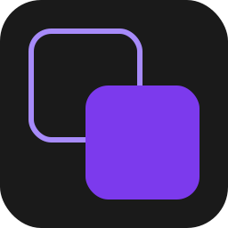
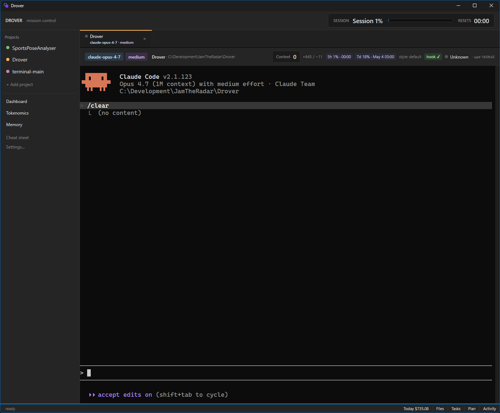
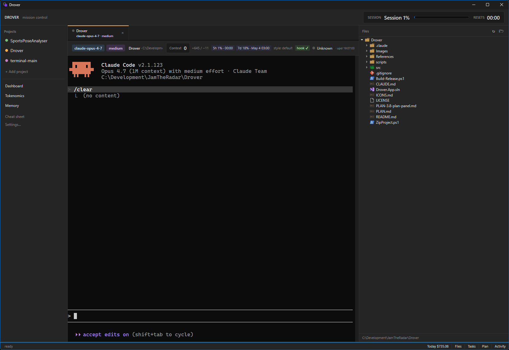
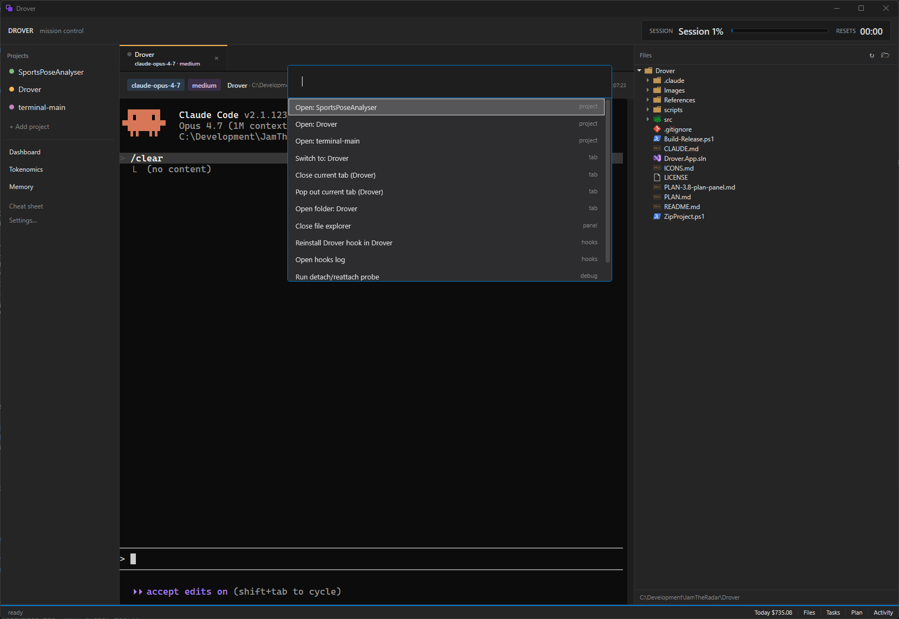

# Drover

<p align="center">
  
</p>

<p align="center">
  <strong>Mission control for Claude Code on Windows.</strong>
</p>

<p align="center">
  Drover hosts multiple <a href="https://docs.claude.com/en/docs/claude-code/overview">Claude Code</a> sessions side-by-side in a single tabbed shell, with a project library, dashboard, plan/task panels, file explorer, and a markdown memory editor.
</p>

---

## Why

Running more than one Claude Code session at a time means juggling terminals, losing track of which agent needs your attention, and context-switching between repos. Drover is a Windows-first WPF app that puts every session in one window and surfaces the state you actually care about — who's working, who's idle waiting on you, what they're saying, what they're costing.

## Features

- **Tabbed Claude Code sessions** — ConPTY-backed terminals via `EasyWindowsTerminalControl`. Open multiple projects, switch with `Ctrl+1..9` / `Ctrl+Tab`.
- **Attention monitoring** — per-tab idle / working / attention state with elapsed timers, taskbar flash, and Windows toasts when an agent goes idle waiting on you.
- **Hooks gateway** — installs Claude Code hooks pointing at a loopback HTTP listener so live `statusLine`, attention, and cost telemetry flow in without scraping the terminal buffer.
- **Project catalog** — add, edit, and remove projects with persistent JSON storage and session restore across restarts.
- **Dashboard** — read-only overview of every running session: project, attention state, working-elapsed, recent activity.
- **Plan / Task panels** — live views of `PLAN.md` / `TASKS.md` style files in the project, with file-system watchers.
- **Markdown memory editor** — AvalonEdit-backed editor for `CLAUDE.md` and other memory files, rendered to FlowDocument.
- **File explorer** (`Alt+E`) — project tree alongside the terminal.
- **Command palette** (`Ctrl+Shift+P`), global find, in-tab find (`Ctrl+F`), rename tab (`F2`).
- **Global hotkey** (``Ctrl+Shift+` ``) to focus Drover from anywhere.
- **Split-right pane and pop-out windows** for two sessions visible at once.
- **Tokenomics** — running token / cost stats per session, fed by the hooks gateway.
- **Auto-update** via Velopack.

## Screenshots

<p align="center">
  
</p>

<p align="center"><em>Main window — tabbed Claude Code sessions with project library, plan/task panels, and dashboard.</em></p>

<p align="center">
  
</p>

<p align="center"><em>File explorer (<code>Alt+E</code>) alongside the active terminal.</em></p>

<p align="center">
  
</p>

<p align="center"><em>Command palette (<code>Ctrl+Shift+P</code>).</em></p>

## Requirements

- Windows 10 19041+ (Windows 11 recommended — title-bar theming silently no-ops on older builds)
- **x64 only** — ConPTY native is x64; AnyCPU and x86 do not work
- [.NET 10 SDK](https://dotnet.microsoft.com/download/dotnet/10.0) to build, .NET 10 Desktop Runtime to run from source
- [Claude Code](https://docs.claude.com/en/docs/claude-code/overview) installed and on `PATH`
- PowerShell 7 (`pwsh`) is the assumed shell

## Install

Grab the latest `Setup.exe` from the [Releases](https://github.com/jamtheradar/Drover/releases) page. Drover updates itself in place via Velopack once installed.

## Build from source

```powershell
git clone https://github.com/jamtheradar/Drover.git
cd Drover
dotnet build src/Drover.App/Drover.App.csproj
dotnet run --project src/Drover.App
```

Or open `Drover.App.sln` in Visual Studio 2022 and hit F5.

### External dependencies

- **`References\Microsoft.Terminal.Control.dll`** — not on NuGet. Download the latest `Microsoft.WindowsTerminal_*_x64.zip` from [microsoft/terminal releases](https://github.com/microsoft/terminal/releases), extract `Microsoft.Terminal.Control.dll`, and drop it into the repo's `References\` folder. The build fails fast with instructions if it's missing.
- **TerminalDependencies NuGet feed** — the `CI.Microsoft.Terminal.Wpf` / `CI.Microsoft.Windows.Console.ConPTY` packages live on a custom Azure DevOps feed. The repo's `NuGet.config` wires this up automatically; you may be prompted to authenticate on first restore.

To produce an installable release (requires the `vpk` global tool):

```powershell
dotnet tool install -g vpk
./Build-Release.ps1 -Version 0.3.0
```

See `Build-Release.ps1` for GitHub upload, channel, and delta-package options.

## Stack

- **.NET 10** WPF, `net10.0-windows10.0.19041.0`, x64
- **MVVM** via [`CommunityToolkit.Mvvm`](https://learn.microsoft.com/en-us/dotnet/communitytoolkit/mvvm/) — source-generated `[ObservableProperty]` / `[RelayCommand]`
- **DI** via `Microsoft.Extensions.Hosting`
- **Terminal** — `CI.Microsoft.Terminal.Wpf` + `CI.Microsoft.Windows.Console.ConPTY` (vendored wrapper at `src/EasyWindowsTerminalControl`)
- **Markdown editor** — AvalonEdit 6.x
- **Toasts** — `Microsoft.Toolkit.Uwp.Notifications`
- **Updates** — [Velopack](https://velopack.io/)

## Repository layout

```
src/
  Drover.App/
    App.xaml(.cs)         DI bootstrap, conpty.dll guard, lifecycle
    Models/               Records: ProjectDefinition, PlanDocument, TaskDocument, *Entry
    Services/             ~25 singletons (catalog, watchers, hooks, tokenomics, logging)
    ViewModels/           ShellViewModel (central state), TerminalTabViewModel (per tab)
    Views/                Windows, panels, dialogs, converters
    Themes/Drover.xaml    Design system — colors, brushes, control styles
  EasyWindowsTerminalControl/   vendored ConPTY host wrapper
```

`PLAN.md` is the live forward roadmap. `CLAUDE.md` is the starting context for Claude Code sessions in this repo.

## Status

Pre-1.0. The shell, tabs, attention monitoring, hooks, dashboard, plan/task panels, and memory editor all work. Tab tear-off is a probe (`Ctrl+Shift+D`), not a real feature. See `PLAN.md` for the punch list.

## Scope

Windows-only. No Mac, no Linux, no SSH, no WinUI 3.

## License

[Apache License 2.0](LICENSE) © 2026 James Noonan.
